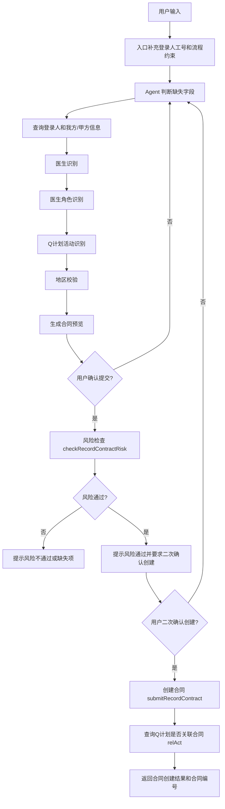

# 录合同 Agent 技术文档

## 1. 功能定位

录合同 Agent 只处理专家授课协议录入流程。入口接收用户自然语言输入，由 Spring AI ChatClient 结合工具方法推进流程，核心目标是完成信息收集、候选识别、地区校验、合同预览、风险检查、二次确认、创建合同和 Q 计划关联合同查询。

当前固定必填字段只有：

- 登录人工号
- 医生姓名或医生编码
- 医生角色
- Q计划活动名称或活动ID
- 授课地区
- 详细地址
- 开始日期
- 结束日期
- 报酬金额

开始日期和结束日期只精确到日，工具层统一转为 `yyyy-MM-dd`。

## 2. 入口与运行链路

### 2.1 HTTP 入口

实现位置：`src/main/java/com/xy/ai/controller/RecordContractAgentController.java`

接口：

```http
GET /ai/record-contract-agent?prompt={prompt}&chatId={chatId}&userCode={userCode}
Accept: text/event-stream
```

处理逻辑：

- 如果 `prompt` 是 `你好`、`您好`、`hi`、`hello`，直接返回 `你好`。
- 如果 `prompt` 为空，返回录合同引导模板。
- 其他输入会拼接当前登录人工号、用户本轮输入和流程约束，然后调用 `recordContractChatClient.stream().content()` 流式输出。
- `userCode` 为空时默认使用 `8106727`。
- 使用 `ChatMemory.CONVERSATION_ID` 绑定 `chatId`，保证多轮对话上下文可延续。

### 2.2 Agent 配置

实现位置：`src/main/java/com/xy/ai/config/CommonConfiguration.java`

关键 Bean：

- `ChatMemory`：使用 `MessageWindowChatMemory` 保存窗口记忆。
- `recordContractChatClient`：绑定系统提示词、日志 Advisor、记忆 Advisor 和 `RecordContractTools`。

系统提示词约束：

- 只处理录合同。
- 候选项不允许模型自行决定，必须展示给用户选择。
- 风险检查通过后必须二次确认，不能直接创建。
- 创建合同只能使用接口返回的 `contractId`，禁止自行生成合同编号。
- 禁止追问合同类型、合同条款、支付方式、付款周期、发票、差旅等泛合同字段。

## 3. 主流程总览



## 4. 配置与外部接口

配置位置：`src/main/resources/application.yaml`

所有录合同外部地址配置在 `record-contract.http.endpoints` 下。工具层通过 `endpoint(key)` 读取，避免 URL 写死在业务代码里。

| 配置 key | 方法 | 用途 |
| --- | --- | --- |
| `base-info-batch` | POST | 根据登录人工号查询人员基本信息 |
| `company-info-by-person` | GET | 查询登录人所属公司和部门 |
| `doctor-list` | POST | 按医生姓名查询个人供应商列表 |
| `doctor-detail` | POST | 查询医生详细信息 |
| `doctor-display` | POST | 展示人员信息，作为医生明细兜底 |
| `ncrm-query` | POST | 查询医生与登录人的营销分配关系 |
| `config-center` | POST | 查询配置中心，获取公司和供应商映射 |
| `signer-bank-info` | POST | 根据供应商编码查询甲方/我方签约和银行信息 |
| `area-list` | GET | 查询省市区树 |
| `q-plan-type-config` | GET | 查询 Q 计划类型 `itemKey` |
| `q-plan-list` | POST | 查询 Q 计划活动列表 |
| `role-cost` | POST | 查询医生角色和金额配置 |
| `risk-check` | POST | 创建前风险检查 |
| `create-contract` | POST | 创建合同 |
| `plan-contract-relation` | GET | 查询 Q 计划是否已关联合同 |

公共请求头：

- `Content-Type: application/json`
- 默认配置头：`reqsource=FEISHU`、`appsource=contractManage`
- 创建合同时额外使用 header：`userCode`、`userName`、`departCode`、`departName`

## 5. 流程节点实现

### 5.1 引导节点：`getRecordContractGuide`

实现方法：`RecordContractTools#getRecordContractGuide`

职责：

- 返回固定必填字段。
- 返回主流程步骤。
- 返回示例输入。

触发场景：

- 用户输入为空。
- Agent 判断首轮信息不足时也可调用。

输出结构：`RecordContractGuide`

- `requiredFields`
- `steps`
- `exampleInput`

### 5.2 登录人和我方/甲方上下文节点：`getCurrentUserContractContext`

实现方法：`RecordContractTools#getCurrentUserContractContext`

职责：

- 查询登录人基本信息。
- 查询所属公司、核算公司和部门。
- 查询配置中心，匹配我方签约供应商编码。
- 查询签约方银行和地址信息。
- 返回可选我方公司列表 `companyOptions`，多公司时必须展示给用户选择。

调用链：

1. `base-info-batch`

请求体：

```json
{
  "personCodeList": ["登录人工号"]
}
```

提取字段：

- `id` -> `userId`
- `personName` -> `userName`
- `tel` -> `phoneNumber`

2. `company-info-by-person`

查询参数：

```text
personCode={登录人工号}
appCode=ContractManage
```

提取字段：

- `companyCode`
- `companyName`
- `accountCompanyCode`
- `accountCompanyName`
- `departInfoDTOS[0].departCode`
- `departInfoDTOS[0].departName`

3. `config-center`

请求体：

```json
{
  "configCode": "supplierCodeReplace",
  "pageNo": 1,
  "pageSize": 998
}
```

处理逻辑：

- 遍历配置列表。
- 用 `companyCode` 或 `accountCompanyCode` 匹配配置项里的 `companyCode`。
- 命中后取 `supplierCode` 作为签约供应商编码。

4. `signer-bank-info`

请求体：

```json
{
  "supplierCode": "签约供应商编码"
}
```

提取字段兼容：

- `supplierId`、`signId`、`id` -> `signerId`
- `supplierName`、`signName`、`name` -> `signerName`
- `addressInfo`、`signAddress`、`address` -> `signerAddress`
- `accountList[0].depositBankName`、`bankName` -> `signerBankName`
- `accountList[0].accountName`、`bankAccountName` -> `signerBankAccountName`
- `accountList[0].accountNumber`、`bankNum`、`bankAccount` -> `signerBankAccount`

输出结构：`CurrentUserContractContext`

### 5.3 医生姓名识别节点：`matchDoctor`

实现方法：`RecordContractTools#matchDoctor`

职责：

- 支持医生编码精确查询。
- 支持医生姓名模糊查询。
- 多候选时展示候选，不自动选择。
- 按登录人的营销分配关系过滤候选医生。

分支 1：传入医生编码

- 直接调用 `queryDoctorDetail(doctorCode, userCode)`。
- 查询成功时返回一个精确候选。
- 查询失败时返回失败消息。

分支 2：传入医生姓名

调用 `doctor-list`。

请求体：

```json
{
  "auditState": "1",
  "pageNo": 1,
  "pageSize": 200,
  "supplierName": "医生姓名"
}
```

候选字段：

- `supplierCode` 或 `doctorCode` -> `doctorCode`
- `supplierName`、`doctorName`、`name` -> `doctorName`
- `orgName` -> `supplierOrgName`
- `expertLevelName`
- `mobile` 或 `phone`
- `id` -> 用于 NCRM 分配关系过滤

候选过滤：`filterDoctorCandidatesByAllocation`

1. 当候选数量大于 1 且有登录人工号时，先通过 `base-info-batch` 查询登录人的 `userId`。
2. 调用 `ncrm-query`。

请求体：

```json
{
  "userId": "登录人ID",
  "doctorIds": ["doctor-list返回的id列表"]
}
```

3. 优先使用返回的 `withAllocation`，为空时使用 `resultList`。
4. 按返回 ID 顺序过滤和排序医生候选。
5. 如果过滤结果为空，保留原候选，避免误杀。

匹配规则：

- 姓名完全归一化相等且只有一个：`exactMatch=true`。
- 完全相等但多个：提示用户选择。
- 没有完全匹配：提示“查到了相近医生”，展示候选。

输出结构：`DoctorMatchResult`

### 5.4 医生明细查询节点：`queryDoctorDetail`

实现方法：`RecordContractTools#queryDoctorDetail`

职责：

- 查询医生详细信息。
- 为角色识别、风险检查、创建合同提供医生级别、证件、银行等信息。

主接口：`doctor-detail`

请求体：

```json
{
  "supplierCode": "医生编码"
}
```

兜底接口：`doctor-display`

- 当 `doctor-detail` 返回空时调用。
- 请求体相同。

提取字段兼容：

- `supplierCode` -> 医生编码和供应商编码
- `supplierName`、`personName`、`name` -> 医生姓名
- `orgName`、`hospitalName` -> 医生机构
- `expertLevelCode`、`expertLevel` -> 专家级别编码
- `expertLevelName` -> 专家级别名称
- `mobile`、`phoneList[0].mobile`、`phoneList[0].phone` -> 手机号
- `cardNo` -> 身份证号
- `accountList[0].accountNumber`、`bankNum`、`bankAccount` -> 银行账号
- `accountList[0].accountName`、`bankAccountName` -> 银行户名
- `accountList[0].depositBankName`、`bankName` -> 银行名称

内部结构：`DoctorDetail`

### 5.5 医生角色识别节点：`matchDoctorRole`

实现方法：`RecordContractTools#matchDoctorRole`

职责：

- 根据医生专家级别查询可用角色。
- 限制角色只能是固定范围。
- 用户角色不匹配时展示候选角色。

允许角色：

- 主持人
- 主席
- 专家咨询会顾问
- 讲者
- 评论嘉宾

调用接口：`role-cost`

请求体：

```json
{
  "expertLevelCode": "医生专家级别编码，缺失时默认 I",
  "roleCode": null
}
```

处理逻辑：

- 拉取角色列表。
- 提取 `roleCode`、`roleName`、金额上限字段。
- 先过滤到允许角色范围。
- 如果用户没有输入角色，返回候选角色列表。
- 如果用户输入角色不在允许范围，返回候选角色列表。
- 如果输入角色和候选角色精确匹配唯一项，则成功。
- 如果无匹配或多匹配，要求用户选择。

输出结构：`RoleMatchResult`

### 5.6 Q计划活动识别节点：`matchPlan`

实现方法：`RecordContractTools#matchPlan`

职责：

- 根据活动名称或活动 ID 查询 Q 计划活动。
- 多候选时展示给用户选择。

第一步：查询 Q 计划类型。

接口：`q-plan-type-config`

查询参数：

```text
categoryCode=QPlanType
```

提取：

- `responseData.itemList[].itemKey`

第二步：查询活动列表。

接口：`q-plan-list`

请求体：

```json
{
  "personCode": "登录人工号",
  "subject": "活动名称",
  "planTypes": ["Q计划类型itemKey列表"],
  "approveStatus": "2",
  "pageNo": 1,
  "pageSize": 30,
  "processTitle": "活动ID或流程标题"
}
```

候选字段：

- `planId`
- `subject` 或 `planName`
- `meetingActivityTypeDesc` 或 `planType`
- `startDateTime` 或 `startDate`
- `endDateTime` 或 `endDate`
- `processTitle`
- `userName`

匹配规则：

- 先按 `planId` 或 `processTitle` 精确匹配。
- 再按活动名称精确匹配。
- 再做包含匹配。
- 精确唯一则成功。
- 多个或相近则返回候选，要求用户确认。

输出结构：`PlanMatchResult`

### 5.7 授课地区校验节点：`validateTeachArea`

实现方法：`RecordContractTools#validateTeachArea`

职责：

- 查询省市区树。
- 校验用户输入的省、市、区县。
- 返回标准地区编码和名称。

接口：`area-list`

请求方式：

```http
GET /crmfront-web/crm/dataConfig/areaList
```

处理逻辑：

- 将省市区树扁平化为 `AreaInfo`。
- 省、市、区县分别按归一化相等或包含关系匹配。
- 命中唯一地区时返回地区编码。
- 没有命中或命中多个时返回 suggestions。

输出结构：`AreaValidationResult`

### 5.8 预览生成节点：`buildContractPreview`

实现方法：`RecordContractTools#buildContractPreview`

职责：

- 汇总当前已知信息。
- 依次调用登录人上下文、医生识别、角色识别、Q计划识别、地区校验。
- 生成合同草稿 `ContractDraft`。
- 返回缺失项、风险提示、候选建议和是否可以进入风险检查。

校验项：

- 必填字段是否完整。
- 日期格式是否可识别。
- 结束日期不能早于开始日期。
- 金额必须大于 0。
- 角色金额上限提示。
- 医生、角色、Q计划、地区必须精确匹配。

日期处理：

- 支持 `yyyy-MM-dd`
- 支持 `yyyy/MM/dd`
- 支持 `yyyy年M月d日`
- 如果传入带时分秒，也会截断为日期。

候选建议：

- 多我方公司：`我方公司候选`
- 多医生：`医生候选`
- 多角色：`角色候选`
- 多活动：`Q计划活动候选`
- 多地区：地区 suggestions

输出结构：`ContractPreview`

关键字段：

- `readyToSubmit`
- `missingFields`
- `warnings`
- `suggestions`
- `draft`

### 5.9 风险检查节点：`checkRecordContractRisk`

实现方法：`RecordContractTools#checkRecordContractRisk`

职责：

- 用户第一次明确确认提交后调用。
- 创建合同前必须先做风险检查。
- 风险通过后只提示用户二次确认创建，不直接创建。

前置条件：

- `buildContractPreview.readyToSubmit=true`

接口：`risk-check`

请求体：

```json
{
  "existExperts": [
    {
      "amount": 800,
      "amountCNY": 800,
      "currencyCode": "CNY",
      "currencyName": "人民币",
      "expertLevel": "专家级别编码",
      "expertLevelName": "专家级别名称",
      "meetingRole": "角色编码",
      "meetingRoleName": "角色名称",
      "signerCode": "医生/供应商编码",
      "signerName": "医生姓名",
      "supplierOrgName": "医生机构",
      "agentCardNo": "身份证号"
    }
  ],
  "planId": "Q计划活动ID",
  "teachTime": "yyyy-MM-dd"
}
```

处理逻辑：

- 调用接口并解析返回。
- 失败时返回风险未通过。
- 成功时将结果放入 `passedRiskChecks`。
- `passedRiskChecks` 的 key 由登录人、医生、角色、活动、日期、金额组成，用于确保提交时不重复风险检查。

输出结构：`ContractRiskCheckResult`

### 5.10 创建合同节点：`submitRecordContract`

实现方法：`RecordContractTools#submitRecordContract`

职责：

- 只有风险检查通过且用户再次确认创建后调用。
- 不再重复调用风险检查。
- 提交创建合同接口。
- 创建后查询 Q 计划是否关联合同。

前置条件：

- `buildContractPreview.readyToSubmit=true`
- `passedRiskChecks` 中存在相同草稿的风险检查通过记录

接口：`create-contract`

请求头：

```text
Content-Type: application/json
userCode: 登录人工号
userName: 登录人姓名
departCode: 部门编码
departName: 部门名称
```

请求体核心结构：

```json
{
  "signer": {},
  "suppliers": [],
  "planInfo": {},
  "basicInfo": {},
  "appSource": "contractManage",
  "reqSource": "FEISHU",
  "teachTime": ["yyyy-MM-dd", "yyyy-MM-dd"],
  "teachAddress": "详细地址",
  "cityName": "城市",
  "provinceName": "省份",
  "countryName": "区县",
  "teachCity": ["省编码", "市编码", "区编码"],
  "limitReason": null,
  "riskInfo": {},
  "teachDuration": "授课天数",
  "version": "1"
}
```

`teachDuration` 计算规则：

- 开始日期到结束日期按闭区间计算。
- 例如 `2026-03-01` 到 `2026-03-02` 为 `2`。

合同编号提取：

- 只从创建接口响应中提取。
- 支持字段：`contractCode`、`contractNo`、`contractId`、`id`
- 如果接口未返回合同编号，必须说明“创建接口未返回合同编号”。
- 禁止模型自行生成合同编号。

输出结构：`ContractSubmissionResult`

### 5.11 Q计划关联合同查询节点：`queryPlanContractRelation`

实现方法：`RecordContractTools#queryPlanContractRelation`

职责：

- 合同创建成功后查询 Q 计划是否已关联合同。

接口：`plan-contract-relation`

查询参数：

```text
planId={Q计划活动ID}
```

处理逻辑：

- 调用接口。
- 优先提取 `message`、`msg`、`relAct`、`related`、`isRelAct`。
- 如果没有文本字段但 responseData 非空，则直接使用 responseData JSON。
- 返回 `relationMessage` 给前端/用户展示。

## 6. 数据结构说明

### 6.1 `CurrentUserContractContext`

表示登录人、公司、部门和签约方上下文。

关键字段：

- `userCode`
- `userName`
- `companyCode`
- `companyName`
- `accountCompanyCode`
- `accountCompanyName`
- `departCode`
- `departName`
- `signerSupplierCode`
- `signerId`
- `signerName`
- `signerAddress`
- `signerBankName`
- `signerBankAccountName`
- `signerBankAccount`
- `companyOptions`

### 6.2 `ContractDraft`

表示可用于风险检查和创建合同的标准化草稿。

关键字段：

- 登录人和部门信息
- 公司和签约方信息
- 医生和供应商信息
- 角色信息
- Q计划活动信息
- 地区和地址信息
- 日期、金额、合同名称、流程标题

### 6.3 `ApiEnvelope`

统一外部接口响应包装。

解析规则：

- 成功码支持：`success=true`、`code=100`、`code=200`、`code=0`
- 消息字段支持：`message`、`msg`、`responseMsg`、`errorMsg`
- 数据字段支持：`responseData`、`data`、`result`

## 7. 候选与异常处理策略

### 7.1 候选处理

以下节点如果查到多个候选，不允许模型自行选择：

- 医生候选
- 医生角色候选
- Q计划活动候选
- 地区候选
- 我方公司候选

用户提示要求：

```text
我查到了以下可选项，请选择一个
```

并列出候选编号、名称和关键编码。

### 7.2 阻断性 warning

`isBlockingWarning` 会把包含以下关键词的 warning 视为阻断：

- `失败`
- `未通过`
- `必须`
- `缺少`

只要存在阻断性 warning，`readyToSubmit=false`。

### 7.3 风险检查幂等约束

风险检查通过后写入 `passedRiskChecks`。提交合同时通过草稿 key 校验是否已经通过风险检查。

如果没有通过记录：

- 不允许创建合同。
- 返回“请先进行风险检查并在通过后再次确认创建合同。”

### 7.4 日志

所有外部接口通过 `postJson` 或 `getJson` 统一输出日志。

POST 日志包括：

- method
- url
- body
- response body

GET 日志包括：

- method
- url
- response body

## 8. 关键文件索引

| 文件 | 说明 |
| --- | --- |
| `src/main/java/com/xy/ai/controller/RecordContractAgentController.java` | SSE 流式入口、问候处理、prompt 注入、会话绑定 |
| `src/main/java/com/xy/ai/config/CommonConfiguration.java` | ChatClient、系统提示词、记忆和工具注册 |
| `src/main/java/com/xy/ai/tools/RecordContractTools.java` | 录合同全部工具节点和外部接口实现 |
| `src/main/resources/application.yaml` | 模型配置、接口地址、默认请求头 |

## 9. 端到端示例

用户输入：

```text
登录人工号 8106727，创建一个专家授课协议，计划名称：创建会议活动接口跑的数据，专家姓名：刘倩倩，角色：讲者，报酬：800元，授课时间：2026年3月1日至2026年3月2日，授课地点：江苏省南京市秦淮区第一人民医院
```

预期执行：

1. 查询登录人和公司部门。
2. 查询配置中心并解析签约供应商编码。
3. 查询签约方银行信息。
4. 按医生姓名查询候选医生。
5. 使用 NCRM 分配关系过滤医生。
6. 查询医生明细。
7. 查询医生角色列表并匹配 `讲者`。
8. 查询 Q 计划类型。
9. 查询 Q 计划活动列表。
10. 校验省市区。
11. 生成合同预览。
12. 用户确认提交后风险检查。
13. 风险通过后要求用户再次确认创建。
14. 用户再次确认后创建合同。
15. 提取接口返回合同编号。
16. 查询 Q 计划是否关联合同。
17. 回复“合同创建成功”、合同编号和关联提示。
