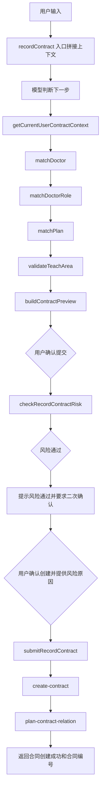

# xiaoyu-ai 技术文档

## 1. 项目概览

`xiaoyu-ai` 是一个基于 Spring Boot 3.4.3、Spring AI 1.0.3、JDK 21 的智能体后端项目，包路径为 `com.xy.ai`。当前后端主要提供四类能力：

- 通用 AI 对话：`/ai/chat`
- 游戏对话：`/ai/game`
- 课程客服：`/ai/service`
- 录合同 Agent：`/ai/record-contract-agent`

前端项目位于 `D:/BaiduNetdiskDownload/spring-ai-protal/spring-ai-protal`，其中 `CustomerService.vue` 调用录合同 Agent 的流式 SSE 接口。

录合同流程固定必填字段：

- 登录人工号
- 医生姓名或编码
- 医生角色
- Q计划活动名称或ID
- 授课地区
- 详细地址
- 开始日期
- 结束日期
- 授课时长
- 报酬金额

## 2. 技术栈

| 类别 | 技术 |
| --- | --- |
| Java | JDK 21 |
| Web 框架 | Spring Boot 3.4.3 |
| AI 框架 | Spring AI 1.0.3 |
| 模型适配 | OpenAI Compatible API |
| 数据访问 | MyBatis-Plus 3.5.10.1 |
| 数据库 | MySQL |
| 前端 | Vue 3 + Vite |
| 流式输出 | Reactor `Flux<String>` + SSE/fetch reader |

## 3. 目录结构

```text
src/main/java/com/xy/ai
  config/                  Spring Bean、CORS、录合同 HTTP 配置
  constants/               系统提示词常量
  controller/              HTTP 接口入口
  entity/                  PO、VO、Query
  mapper/                  MyBatis-Plus Mapper
  repository/              会话历史仓储
  service/                 MyBatis-Plus Service 接口和实现
  tools/                   Spring AI Tool 方法
  utils/                   工具类

src/main/resources
  application.yaml         模型、数据库、录合同外部接口配置
  mapper/*.xml             Mapper XML

docs/
  record-contract-flow.md  旧版录合同流程文档
  technical-documentation.md 当前完整技术文档
```

## 4. 启动与配置

### 4.1 启动命令

```powershell
$env:JAVA_HOME='C:\Users\LENOVO\.jdks\dragonwell-21.0.10'
$env:Path="$env:JAVA_HOME\bin;$env:Path"
& 'D:\MAVEN\apache-maven-3.9.9\apache-maven-3.9.9\bin\mvn.cmd' spring-boot:run
```

### 4.2 编译验证

```powershell
$env:JAVA_HOME='C:\Users\LENOVO\.jdks\dragonwell-21.0.10'
$env:Path="$env:JAVA_HOME\bin;$env:Path"
& 'D:\MAVEN\apache-maven-3.9.9\apache-maven-3.9.9\bin\mvn.cmd' -q -DskipTests compile
```

### 4.3 配置说明

配置文件：`src/main/resources/application.yaml`

敏感项不要写入文档或日志：

- `spring.ai.openai.api-key`
- `spring.datasource.password`

模型相关配置：

```yaml
spring:
  ai:
    openai:
      base-url: https://aigw.cttq.com
      api-key: ${OPENAI_API_KEY}
      chat:
        completions-path: /v1/chat/completions
        options:
          model: qwen3.6-plus
          temperature: 0.7
```

录合同外部接口统一配置在：

```yaml
record-contract:
  http:
    open-url: ...
    default-headers:
      reqsource: FEISHU
      appsource: contractManage
    endpoints:
      base-info-batch: ...
      company-info-by-person: ...
      doctor-list: ...
      doctor-detail: ...
      doctor-display: ...
      ncrm-query: ...
      config-center: ...
      signer-bank-info: ...
      area-list: ...
      q-plan-type-config: ...
      q-plan-list: ...
      role-cost: ...
      risk-check: ...
      plan-contract-relation: ...
      create-contract: ...
```

## 5. 后端 HTTP 接口

### 5.1 `ChatController#chat`

文件：`src/main/java/com/xy/ai/controller/ChatController.java`

接口：

```http
POST /ai/chat
Content-Type: application/x-www-form-urlencoded 或 multipart/form-data
```

参数：

| 参数 | 必填 | 说明 |
| --- | --- | --- |
| `prompt` | 是 | 用户输入 |
| `chatId` | 是 | 会话 ID |
| `files` | 否 | 多模态文件列表 |

调用示例：

```bash
curl -N -X POST "http://localhost:8081/ai/chat" \
  -d "prompt=你好&chatId=chat-1"
```

方法逻辑：

- 缺少 `prompt` 时返回参数提示。
- 缺少 `chatId` 时返回参数提示。
- 调用 `chatHistoryRepository.save("chat", chatId)` 保存会话编号。
- 没有文件时调用私有方法 `textChat(prompt, chatId)`。
- 有文件时调用私有方法 `multiModalChat(prompt, chatId, files)`。

私有方法：

- `textChat(String prompt, String chatId)`：给用户输入加 `/no_think`，绑定 `ChatMemory.CONVERSATION_ID`，调用 `chatClient.stream().content()`。
- `multiModalChat(String prompt, String chatId, List<MultipartFile> files)`：把文件转成 Spring AI `Media`，再进行多模态流式调用。
- `noThink(String prompt)`：返回 `"/no_think\n" + prompt`。

返回：

- `Flux<String>`，前端按流读取。

### 5.2 `RecordContractAgentController#recordContract`

文件：`src/main/java/com/xy/ai/controller/RecordContractAgentController.java`

接口：

```http
GET /ai/record-contract-agent?prompt={prompt}&chatId={chatId}&userCode={userCode}
Accept: text/event-stream
```

参数：

| 参数 | 必填 | 默认值 | 说明 |
| --- | --- | --- | --- |
| `prompt` | 是 | 无 | 用户本轮输入 |
| `chatId` | 是 | 无 | 会话 ID |
| `userCode` | 否 | `8106727` | 当前登录人工号 |

调用示例：

```bash
curl -N "http://localhost:8081/ai/record-contract-agent?prompt=你好&chatId=rc-1"
```

方法逻辑：

- 先解析登录人工号，未传时使用默认工号。
- 调用 `chatHistoryRepository.save("record-contract-agent", chatId)` 记录会话。
- 如果 `prompt` 是问候语，直接返回 `你好`，不调用模型。
- 如果 `prompt` 为空，调用 `recordContractTools.getRecordContractGuide()` 返回录合同引导。
- 否则拼接录合同流程约束和用户本轮输入，调用 `recordContractChatClient.stream().content()`。

私有方法：

- `isGreeting(String prompt)`：判断 `你好`、`您好`、`hi`、`hello`。

返回：

- `Flux<String>`，`produces = text/event-stream`。

### 5.3 `CustomerServiceController#service`

文件：`src/main/java/com/xy/ai/controller/CustomerServiceController.java`

接口：

```http
GET /ai/service?prompt={prompt}&chatId={chatId}
```

用途：

- 课程咨询客服入口，绑定 `CourseTools`。

调用示例：

```bash
curl -N "http://localhost:8081/ai/service?prompt=我想学编程&chatId=svc-1"
```

方法逻辑：

- 保存 `service` 类型会话。
- 给用户输入加 `/no_think`。
- 绑定会话 ID。
- 调用 `serviceChatClient.stream().content()`。

### 5.4 `GameController#chat`

文件：`src/main/java/com/xy/ai/controller/GameController.java`

接口：

```http
GET /ai/game?prompt={prompt}&chatId={chatId}
```

调用示例：

```bash
curl -N "http://localhost:8081/ai/game?prompt=女朋友生气了&chatId=game-1"
```

方法逻辑：

- 给用户输入加 `/no_think`。
- 绑定 `ChatMemory.CONVERSATION_ID`。
- 调用 `gameChatClient.stream().content()`。

### 5.5 `ChatHistoryController#getChatIds`

文件：`src/main/java/com/xy/ai/controller/ChatHistoryController.java`

接口：

```http
GET /ai/history/{type}
```

参数：

| 参数 | 说明 |
| --- | --- |
| `type` | 会话类型，如 `chat`、`service`、`record-contract-agent` |

调用示例：

```bash
curl "http://localhost:8081/ai/history/record-contract-agent"
```

方法逻辑：

- 调用 `chatHistoryRepository.getChatIds(type)`。

返回：

```json
["chatId1", "chatId2"]
```

### 5.6 `ChatHistoryController#getChatHistory`

接口：

```http
GET /ai/history/{type}/{chatId}
```

调用示例：

```bash
curl "http://localhost:8081/ai/history/record-contract-agent/rc-1"
```

方法逻辑：

- 从 `ChatMemory` 中读取 `chatId` 对应消息。
- 转成 `MessageVO` 列表。

返回：

```json
[
  {"role": "user", "content": "..."},
  {"role": "assistant", "content": "..."}
]
```

## 6. Spring AI Bean

### 6.1 `CommonConfiguration#chatMemory`

调用方式：

- Spring 自动注入。

实现：

```java
MessageWindowChatMemory.builder().build()
```

用途：

- 保存多轮对话窗口记忆。

### 6.2 `CommonConfiguration#chatClient`

调用方：

- `ChatController`

功能：

- 通用对话。
- 系统角色是“小团团”。

### 6.3 `CommonConfiguration#gameChatClient`

调用方：

- `GameController`

功能：

- 使用 `SystemConstants.GAME_SYSTEM_PROMPT`。

### 6.4 `CommonConfiguration#serviceChatClient`

调用方：

- `CustomerServiceController`

功能：

- 使用 `SystemConstants.SERVICE_SYSTEM_PROMPT`。
- 注册 `CourseTools`，模型可调用课程查询和预约工具。

### 6.5 `CommonConfiguration#recordContractChatClient`

调用方：

- `RecordContractAgentController`

功能：

- 使用录合同 Agent 系统提示词。
- 注册 `RecordContractTools`。
- 使用 `SimpleLoggerAdvisor` 和 `MessageChatMemoryAdvisor`。

核心约束：

- 只处理录合同。
- 必须调用工具查真实数据。
- 风控通过后必须二次确认。
- 创建合同编号只能来自接口返回。

## 7. 录合同 Agent 主流程



## 8. `RecordContractTools` 对外 Tool 方法

### 8.1 `getRecordContractGuide()`

文件：`src/main/java/com/xy/ai/tools/RecordContractTools.java`

调用方式：

- 模型工具调用：无需参数。
- 直接 Java 调用：`recordContractTools.getRecordContractGuide()`。

返回：

```json
{
  "requiredFields": ["登录人工号", "医生姓名或编码", "..."],
  "steps": ["查登录人和签约信息", "..."],
  "exampleInput": "登录人工号 2020665，医生 张三..."
}
```

用途：

- 首轮信息不足时展示录合同模板。

### 8.2 `getCurrentUserContractContext(String userCode)`

调用方式：

```java
recordContractTools.getCurrentUserContractContext("8106727");
```

Tool 参数：

| 参数 | 必填 | 说明 |
| --- | --- | --- |
| `userCode` | 是 | 登录人工号 |

内部调用：

1. `base-info-batch`
2. `company-info-by-person`
3. `config-center`
4. `signer-bank-info`

返回结构：`CurrentUserContractContext`

关键返回字段：

- `userCode`
- `userName`
- `phoneNumber`
- `companyCode`
- `companyName`
- `accountCompanyCode`
- `accountCompanyName`
- `departCode`
- `departName`
- `signerSupplierCode`
- `signerId`
- `signerName`
- `signerAddress`
- `signerBankName`
- `signerBankAccountName`
- `signerBankCode`
- `signerBankAccount`
- `companyOptions`
- `message`

异常处理：

- 登录人基本信息接口失败时返回空上下文和失败消息。
- 我方公司/部门接口失败时返回空上下文和失败消息。
- 缺少我方签约供应商信息时阻断后续流程。

### 8.3 `matchDoctor(String doctorName, String doctorCode, String userCode)`

调用方式：

```java
recordContractTools.matchDoctor("刘倩倩", null, "8106727");
recordContractTools.matchDoctor(null, "10169969", "8106727");
```

Tool 参数：

| 参数 | 必填 | 说明 |
| --- | --- | --- |
| `doctorName` | 否 | 医生姓名 |
| `doctorCode` | 否 | 医生编码 |
| `userCode` | 否 | 登录人工号，用于过滤分配关系 |

内部调用：

- 有 `doctorCode`：调用 `doctor-detail`，空结果时调用 `doctor-display`。
- 有 `doctorName`：调用 `doctor-list`。
- 多候选时调用 `ncrm-query` 过滤营销分配关系。

返回结构：`DoctorMatchResult`

```json
{
  "exactMatch": true,
  "message": "已匹配到医生。",
  "candidates": [
    {
      "doctorCode": "10169969",
      "doctorName": "刘倩倩",
      "supplierCode": "10169969",
      "supplierOrgName": "...",
      "expertLevelName": "...",
      "mobile": "...",
      "id": "..."
    }
  ]
}
```

调用规则：

- 精确匹配唯一医生时继续下一步。
- 多候选或不完全匹配时，必须提示用户选择。

### 8.4 `matchDoctorRole(String doctorCode, String roleName, String userCode)`

调用方式：

```java
recordContractTools.matchDoctorRole("10169969", "讲者", "8106727");
```

参数：

| 参数 | 必填 | 说明 |
| --- | --- | --- |
| `doctorCode` | 是 | 医生编码 |
| `roleName` | 否 | 用户输入角色 |
| `userCode` | 否 | 登录人工号 |

内部调用：

- 先调用 `queryDoctorDetail` 获取医生专家级别。
- 再调用 `role-cost` 查询角色。

允许角色：

- 主持人
- 主席
- 专家咨询会顾问
- 讲者
- 评论嘉宾

返回结构：`RoleMatchResult`

关键字段：

- `exactMatch`
- `message`
- `candidates`
- `warnings`

调用规则：

- 用户角色不在允许范围时，不自动填值，返回候选角色。
- `expertLevelCode` 缺失时，接口参数使用默认值 `I`，但创建合同时专家级别字段仍为空字符串。

### 8.5 `matchPlan(String planName, String planId, String userCode)`

调用方式：

```java
recordContractTools.matchPlan("创建会议活动接口跑的数据", null, "8106727");
recordContractTools.matchPlan(null, "111c598cc74043ed91cb5d37c403264e", "8106727");
```

参数：

| 参数 | 必填 | 说明 |
| --- | --- | --- |
| `planName` | 否 | Q计划活动名称 |
| `planId` | 否 | 活动 ID 或计划编码 |
| `userCode` | 否 | 登录人工号 |

内部调用：

1. `q-plan-type-config`
2. `q-plan-list`

`q-plan-list` 请求体：

```json
{
  "personCode": "8106727",
  "subject": "活动名称",
  "planTypes": ["activity-meeting"],
  "approveStatus": "2",
  "pageNo": 1,
  "pageSize": 30,
  "processTitle": "计划编码"
}
```

返回结构：`PlanMatchResult`

候选结构：`PlanSummary`

- `planId`
- `planName`
- `planType`
- `startTime`
- `endTime`
- `planCode`
- `ownerName`
- `productTypeCode`

调用规则：

- 传 32 位十六进制 ID 时按 `planId` 匹配。
- 传计划编码时走 `processTitle`。
- 多候选时展示活动 ID、计划编码、活动名、负责人、时间。

### 8.6 `validateTeachArea(String provinceName, String cityName, String districtName, String detailAddress)`

调用方式：

```java
recordContractTools.validateTeachArea("江苏省", "南京市", "秦淮区", "第一人民医院");
```

参数：

| 参数 | 必填 | 说明 |
| --- | --- | --- |
| `provinceName` | 否 | 省 |
| `cityName` | 否 | 市 |
| `districtName` | 否 | 区县 |
| `detailAddress` | 否 | 详细地址 |

内部调用：

- `area-list`

返回结构：`AreaValidationResult`

关键字段：

- `valid`
- `provinceCode`
- `provinceName`
- `cityCode`
- `cityName`
- `districtCode`
- `districtName`
- `detailAddress`
- `suggestions`

调用规则：

- 至少提供省、市、区中的一项。
- 唯一命中时返回编码。
- 多命中或未命中时返回候选，让用户重新选择。

### 8.7 `buildContractPreview(...)`

调用方式：

```java
recordContractTools.buildContractPreview(
    "8106727",
    "刘倩倩",
    null,
    "讲者",
    "创建会议活动接口跑的数据",
    null,
    "江苏省",
    "南京市",
    "秦淮区",
    "第一人民医院",
    "2026-03-01",
    "2026-03-02",
    "2",
    800
);
```

参数：

| 参数 | 必填 | 说明 |
| --- | --- | --- |
| `userCode` | 是 | 登录人工号 |
| `doctorName` | 否 | 医生姓名 |
| `doctorCode` | 否 | 医生编码 |
| `roleName` | 否 | 医生角色 |
| `planName` | 否 | Q计划活动名称 |
| `planId` | 否 | Q计划活动 ID |
| `provinceName` | 否 | 省 |
| `cityName` | 否 | 市 |
| `districtName` | 否 | 区县 |
| `detailAddress` | 否 | 详细地址 |
| `startTime` | 否 | 开始日期，`yyyy-MM-dd` |
| `endTime` | 否 | 结束日期，`yyyy-MM-dd` |
| `teachDuration` | 否 | 授课时长，字符串，用户输入，没有单位，不自动计算，不追加单位 |
| `amount` | 否 | 报酬金额 |

内部调用顺序：

1. `getCurrentUserContractContext`
2. `matchDoctor`
3. `matchDoctorRole`
4. `matchPlan`
5. `validateTeachArea`
6. 日期、金额、候选、阻断项校验

返回结构：`ContractPreview`

关键字段：

- `readyToSubmit`
- `message`
- `missingFields`
- `warnings`
- `suggestions`
- `draft`

调用规则：

- `readyToSubmit=false` 时不能调用风险检查。
- `suggestions` 不为空时必须让用户选择。
- `missingFields` 不为空时只追问缺失项。
- `teachDuration` 是必填业务字段，但工具参数标记为非必填，用于让模型分阶段补齐。

### 8.8 `checkRecordContractRisk(...)`

调用方式：

```java
recordContractTools.checkRecordContractRisk(
    "8106727",
    "刘倩倩",
    null,
    "讲者",
    "创建会议活动接口跑的数据",
    "111c598cc74043ed91cb5d37c403264e",
    "江苏省",
    "南京市",
    "秦淮区",
    "第一人民医院",
    "2026-03-01",
    "2026-03-02",
    "2",
    800
);
```

参数同 `buildContractPreview`，但字段应已齐全。

内部调用：

- 先重新调用 `buildContractPreview`。
- 如果预览不通过，返回“未调用风险检查接口”。
- 预览通过后调用 `risk-check`。

风险接口请求体：

```json
{
  "existExperts": [
    {
      "amount": 800,
      "amountCNY": 800,
      "currencyCode": "CNY",
      "currencyName": "人民币",
      "expertLevel": "",
      "expertLevelName": "",
      "meetingRole": "4",
      "meetingRoleName": "讲者",
      "signerCode": "10169969",
      "signerName": "刘倩倩",
      "supplierOrgName": "医生机构",
      "agentCardNo": "身份证号"
    }
  ],
  "planId": "活动ID",
  "teachTime": "2026-03-01"
}
```

返回结构：`ContractRiskCheckResult`

关键字段：

- `riskPassed`
- `readyToCreate`
- `message`
- `warnings`
- `draft`
- `riskInfo`

调用规则：

- 风险检查通过后，只能提示用户风险通过并要求二次确认创建。
- 不允许在风险检查成功后直接调用创建合同。

### 8.9 `submitRecordContract(...)`

调用方式：

```java
recordContractTools.submitRecordContract(
    "8106727",
    "刘倩倩",
    null,
    "讲者",
    "创建会议活动接口跑的数据",
    "111c598cc74043ed91cb5d37c403264e",
    "江苏省",
    "南京市",
    "秦淮区",
    "第一人民医院",
    "2026-03-01",
    "2026-03-02",
    "2",
    "业务已确认，允许继续创建",
    800
);
```

参数：

| 参数 | 必填 | 说明 |
| --- | --- | --- |
| 前 13 个业务参数 | 是 | 与风险检查保持一致 |
| `limitReason` | 风险提醒存在时必填 | 用户针对风险检查提醒输入的原因，写入创建合同请求体 `limitReason` |
| `amount` | 是 | 报酬金额 |

前置条件：

- 同一草稿已通过 `checkRecordContractRisk`。
- 用户再次明确确认创建。
- 如果风险检查返回了风险信息，必须传入 `limitReason`。

内部调用：

1. 重新生成预览。
2. 从 `passedRiskChecks` 获取风险检查通过记录。
3. 校验有风险信息时必须有 `limitReason`。
4. 调用 `create-contract`。
5. 创建成功后调用 `plan-contract-relation`。
6. 移除风险通过缓存。

创建合同请求体关键字段：

- `appSource`
- `basicInfo`
- `cityName`
- `countryName`
- `departCode`
- `departName`
- `limitReason`
- `planInfo`
- `provinceName`
- `reqSource`
- `riskInfo`
- `signer`
- `suppliers`
- `teachAddress`
- `teachCity`
- `teachTime`
- `userCode`
- `userName`
- `teachDuration`
- `version`

返回结构：`ContractSubmissionResult`

关键字段：

- `success`
- `message`
- `contractId`
- `warnings`
- `draft`
- `openUrl`
- `relationMessage`

创建成功回复规则：

- 必须回复“合同创建成功”。
- 合同编号只能取 `contractId`。
- 如果 `contractId` 为空，必须说“创建接口未返回合同编号”。
- `relationMessage` 不为空时追加提示。

## 9. `RecordContractTools` 私有方法说明

这些方法不由模型直接调用，但决定外部接口参数、解析和流程状态。

### 9.1 风险与创建请求组装

| 方法 | 调用方 | 功能 |
| --- | --- | --- |
| `buildRiskCheckPayload(ContractDraft)` | `checkRecordContractRisk` | 组装 `risk-check` 请求体 |
| `buildRiskCheckExpert(ContractDraft)` | `buildRiskCheckPayload` | 组装 `existExperts[0]` |
| `buildCreateContractPayload(ContractDraft, Object, String)` | `submitRecordContract` | 组装 `create-contract` 请求体，第三个参数写入 `limitReason` |
| `buildExpertSignInfo(ContractDraft, DoctorDetail)` | `buildCreateContractPayload` | 组装供应商里的 `expertSignInfoDTO` |

### 9.2 HTTP 调用

| 方法 | 调用方式 | 功能 |
| --- | --- | --- |
| `endpoint(String key)` | `endpoint("risk-check")` | 从配置读取外部接口地址 |
| `postJson(String url, Object body, Map headers)` | 各 POST 节点 | 发送 JSON POST，统一日志和响应解析 |
| `getJson(String url, Map queryParams, Map headers)` | 各 GET 节点 | 拼接 query 参数并发送 GET |
| `parseApiEnvelope(String responseText)` | HTTP 方法内部 | 统一解析 `code/message/responseData` |
| `applyHeaders(HttpHeaders, Map)` | HTTP 方法内部 | 写入请求头 |
| `safeHeaderValue(String)` | `userHeaders/createContractHeaders` | URL 编码中文 header 值，避免 JDK HTTP 非 ASCII header 报错 |
| `isAreaListUrl(String)` | `postJson/getJson` | 判断是否地区接口，避免打印超大返回日志 |

### 9.3 登录人、签约方、医生解析

| 方法 | 调用方 | 功能 |
| --- | --- | --- |
| `emptyCurrentUserContext(String)` | 登录人查询失败时 | 返回空上下文和失败原因 |
| `userHeaders(...)` | 外部接口调用前 | 生成常规接口 header |
| `jsonHeaders()` | 地区接口 | 只生成 JSON header |
| `createContractHeaders(ContractDraft)` | 创建合同 | 生成创建合同所需 header |
| `resolveSignerSupplierCode(...)` | `getCurrentUserContractContext` | 从配置中心匹配签约供应商编码 |
| `querySignerInfo(...)` | `getCurrentUserContractContext` | 查询甲方/我方签约方和银行信息 |
| `extractCompanyOptions(JsonNode)` | `getCurrentUserContractContext` | 从所属公司接口提取可选公司 |
| `queryDoctorDetail(...)` | 医生、角色、创建合同 | 查询医生明细，必要时走兜底接口 |
| `toDoctorSummary(DoctorDetail)` | `matchDoctor` | 把医生明细转为候选摘要 |
| `filterDoctorCandidatesByAllocation(...)` | `matchDoctor` | 用 NCRM 分配关系过滤医生 |
| `queryUserId(String)` | NCRM 过滤 | 根据工号查询人员 ID |

### 9.4 匹配算法

| 方法 | 功能 |
| --- | --- |
| `matchRoles(...)` | 从角色列表中找与用户输入相近的角色 |
| `exactRoles(...)` | 精确匹配角色 |
| `allowedRoleCandidates(...)` | 只保留允许的五类角色 |
| `isAllowedRoleName(...)` | 判断角色是否在允许范围 |
| `matchPlans(...)` | 按活动 ID、计划编码、名称匹配活动 |
| `exactPlans(...)` | Q计划精确匹配 |
| `planCodeQueryValue(...)` | 判断传入值是否适合放到 `processTitle` |
| `isLikelyPlanId(...)` | 32 位十六进制字符串视为活动 ID |

### 9.5 地区、日期、预览

| 方法 | 功能 |
| --- | --- |
| `extractPlanTypes(JsonNode)` | 提取 Q计划类型 `itemKey` |
| `flattenAreas(JsonNode)` | 把省市区树扁平化 |
| `collectAreas(...)` | 递归收集省市区 |
| `matchesAreaPart(String, String)` | 地区名称归一化匹配 |
| `parseDateTime(String)` | 支持多种日期格式并截断到日 |
| `formatDate(LocalDateTime)` | 输出 `yyyy-MM-dd` |
| `buildContractName(LocalDateTime)` | 生成合同名称 `授课服务协议yyyyMMdd` |
| `buildProcessTitle(...)` | 生成内部流程标题 |
| `optionalPlanWarnings(...)` | 预留活动/医生额外检查，目前返回空 |

### 9.6 提示、阻断与返回处理

| 方法 | 功能 |
| --- | --- |
| `isBlockingWarning(String)` | 判断 warning 是否阻断提交 |
| `shouldStopFlow(List<String>)` | 判断是否停止后续工具调用 |
| `isInterfaceFailureMessage(String)` | 判断是否接口失败类提示 |
| `joinDoctorCandidates(...)` | 拼接医生候选文本 |
| `joinRoleCandidates(...)` | 拼接角色候选文本 |
| `joinPlanCandidates(...)` | 拼接 Q计划候选文本 |
| `joinCompanyOptions(...)` | 拼接我方公司候选文本 |
| `expertLevelWarning(DoctorDetail)` | 专家级别缺失提示 |
| `buildTeachTime(...)` | 创建合同 `teachTime` 数组 |
| `arrayOrEmpty(JsonNode)` | 空 JSON 数组兜底 |
| `buildTeachCity(...)` | 创建合同 `teachCity` 编码数组 |
| `riskInfoNode(ApiEnvelope)` | 提取风险信息 |
| `hasRiskInfo(JsonNode)` | 判断风险结果是否含实际风险信息 |
| `queryPlanContractRelation(...)` | 创建成功后查询 Q计划是否关联合同 |
| `buildRelationMessage(...)` | `responseData=false` 时提示未创建 e 活动；`true` 不提示 |
| `draftRiskKey(ContractDraft)` | 生成风险检查缓存 key |
| `buildCreateMessage(...)` | 创建合同成功/失败文案 |
| `extractContractId(ApiEnvelope)` | 从接口返回中提取合同编号 |

### 9.7 JSON 和字符串工具

| 方法 | 功能 |
| --- | --- |
| `directNodeText(JsonNode)` | 直接取 JSON 节点文本 |
| `safeJson(Object)` | 安全序列化日志 JSON |
| `writeJson(Object)` | 序列化为请求字段字符串 |
| `mergeMessages(String...)` | 合并接口消息 |
| `firstItem(JsonNode)` | 取数组或列表第一个元素 |
| `listItems(JsonNode)` | 兼容 `list/records/rows/itemList` 等列表字段 |
| `iterable(JsonNode)` | 把 JSON 数组转 Iterable |
| `stringList(JsonNode)` | 提取字符串列表 |
| `text(JsonNode, String...)` | 按多个字段名取第一个非空字符串 |
| `integerValue(JsonNode, String...)` | 按多个字段名取整数 |
| `withFallback(String, String)` | 空字符串兜底 |
| `blankToNull(String)` | 空白字符串转 null |
| `firstNonBlank(String...)` | 取第一个非空字符串 |
| `firstNonBlankOrEmpty(String...)` | 取第一个非空字符串，空则返回 `""` |
| `listOfNonBlank(String...)` | 过滤非空字符串为列表 |
| `equalsNormalized(String, String)` | 归一化后判断相等 |
| `containsEither(String, String)` | 双向包含匹配 |
| `normalize(String)` | 去空格、转小写、去常见标点 |
| `uniqueList(List<String>)` | 保序去重 |

## 10. 课程客服 Tool 方法

文件：`src/main/java/com/xy/ai/tools/CourseTools.java`

### 10.1 `queryCourse(CourseQuery query)`

调用方式：

```java
courseTools.queryCourse(null);

CourseQuery query = new CourseQuery();
query.setType("编程");
query.setEdu(2);
courseTools.queryCourse(query);
```

Tool 调用场景：

- 用户咨询课程。
- 模型已收集学习兴趣和学历。

查询逻辑：

- `query == null`：返回所有课程。
- `type` 非空：按课程类型等值查询。
- `edu` 非空：查询 `edu <= 用户学历` 的课程。
- `sorts` 非空：按指定字段排序。

返回：

- `List<Course>`

### 10.2 `querySchool()`

调用方式：

```java
courseTools.querySchool();
```

用途：

- 预约试听前查询所有校区。

返回：

- `List<School>`

### 10.3 `createCourseReservation(String course, String school, String studentName, String contactInfo, String remark)`

调用方式：

```java
courseTools.createCourseReservation("Java", "北京校区", "张三", "13800000000", "周末方便");
```

参数：

| 参数 | 必填 | 说明 |
| --- | --- | --- |
| `course` | 是 | 预约课程 |
| `school` | 是 | 预约校区 |
| `studentName` | 是 | 学生姓名 |
| `contactInfo` | 是 | 联系电话 |
| `remark` | 否 | 备注 |

实现：

- 构造 `CourseReservation`。
- 调用 `reservationService.save(reservation)`。
- 返回数据库自增 ID。

## 11. 仓储、实体和工具类

### 11.1 `ChatHistoryRepository`

接口方法：

| 方法 | 调用方式 | 说明 |
| --- | --- | --- |
| `save(String type, String chatId)` | `save("chat", "1")` | 保存会话 ID |
| `getChatIds(String type)` | `getChatIds("chat")` | 查询某类型会话 ID 列表 |

### 11.2 `InMemoryChatHistoryRepository`

方法：

- `save(String type, String chatId)`：按类型保存会话 ID；重复 ID 不重复写入。
- `getChatIds(String type)`：返回会话列表，不存在时返回空列表。
- `init()`：应用启动后读取 `chat-history.json` 和 `chat-memory.json`。
- `convertMsgToMessage(String chatId, List<Msg> messages)`：把持久化消息恢复到 `ChatMemory`。
- `persistent()`：应用关闭前把历史和记忆写回 JSON 文件。
- `getMemoryJsonString()`：把 `ChatMemory` 转为 JSON 字符串。
- `toJsonString(Object object)`：统一 JSON 序列化。

### 11.3 `Msg`

方法：

- `Msg(Message message)`：把 Spring AI `Message` 转成可序列化对象。
- `toMessage()`：根据 `messageType` 恢复成 `SystemMessage`、`UserMessage` 或 `AssistantMessage`。

### 11.4 `MessageVO`

方法：

- `MessageVO(Message message)`：把历史消息转为前端需要的 `role/content`。

映射规则：

- `USER` -> `user`
- `ASSISTANT` -> `assistant`
- 其他 -> 空字符串

### 11.5 `Result`

方法：

- `Result.ok()`：返回 `{ok: 1, msg: "ok"}`
- `Result.fail(String msg)`：返回 `{ok: 0, msg: msg}`

### 11.6 `VectorDistanceUtils`

方法：

- `euclideanDistance(float[] vectorA, float[] vectorB)`：校验向量后计算欧氏距离。
- `cosineDistance(float[] vectorA, float[] vectorB)`：校验向量后计算余弦相似度值，当前方法名叫距离但返回的是 similarity。
- `validateVectors(float[] a, float[] b)`：私有方法，校验非空、等长、非空数组。

调用示例：

```java
double value = VectorDistanceUtils.euclideanDistance(new float[]{1, 2}, new float[]{2, 4});
```

## 12. 数据访问层

### 12.1 Service 接口

| 接口 | 继承 | 说明 |
| --- | --- | --- |
| `ICourseService` | `IService<Course>` | 课程表服务 |
| `ISchoolService` | `IService<School>` | 校区表服务 |
| `ICourseReservationService` | `IService<CourseReservation>` | 预约单服务 |

调用方式：

```java
courseService.list();
schoolService.list();
reservationService.save(reservation);
```

### 12.2 Service 实现

| 类 | 继承 | 说明 |
| --- | --- | --- |
| `CourseServiceImpl` | `ServiceImpl<CourseMapper, Course>` | 课程服务实现 |
| `SchoolServiceImpl` | `ServiceImpl<SchoolMapper, School>` | 校区服务实现 |
| `CourseReservationServiceImpl` | `ServiceImpl<CourseReservationMapper, CourseReservation>` | 预约服务实现 |

这些类没有自定义方法，直接使用 MyBatis-Plus 默认 CRUD。

### 12.3 Mapper

| Mapper | 继承 | 表 |
| --- | --- | --- |
| `CourseMapper` | `BaseMapper<Course>` | `course` |
| `SchoolMapper` | `BaseMapper<School>` | `school` |
| `CourseReservationMapper` | `BaseMapper<CourseReservation>` | `course_reservation` |

## 13. 配置类

### 13.1 `RecordContractHttpProperties`

绑定前缀：

```text
record-contract.http
```

方法：

- `getOpenUrl()/setOpenUrl()`：合同系统前端打开地址。
- `getDefaultHeaders()/setDefaultHeaders()`：默认请求头。
- `getEndpoints()/setEndpoints()`：外部接口地址映射。

### 13.2 `MvcConfiguration#addCorsMappings`

调用方式：

- Spring MVC 自动调用。

配置：

- 路径：`/**`
- 允许来源：`*`
- 允许方法：`GET`、`POST`、`PUT`、`DELETE`、`OPTIONS`
- 允许请求头：`*`
- 暴露响应头：`Content-Disposition`

### 13.3 `XiaoyuAiApplication#main`

调用方式：

```java
SpringApplication.run(XiaoyuAiApplication.class, args);
```

注解：

- `@SpringBootApplication`
- `@MapperScan("com.xy.ai.mapper")`

## 14. 前端调用说明

前端文件：`D:/BaiduNetdiskDownload/spring-ai-protal/spring-ai-protal/src/services/api.js`

### 14.1 `chatAPI.sendServiceMessage(prompt, chatId, options)`

调用接口：

```http
GET http://localhost:8081/ai/record-contract-agent?prompt={prompt}&chatId={chatId}
Accept: text/event-stream
```

调用示例：

```js
const controller = new AbortController()
const reader = await chatAPI.sendServiceMessage('你好', 'chat-1', {
  signal: controller.signal
})
```

返回：

- `response.body.getReader()`

中断：

```js
controller.abort()
```

### 14.2 `CustomerService.vue#sendMessage`

职责：

- 添加用户消息。
- 添加空助手消息作为流式占位。
- 创建 `AbortController`。
- 调用 `chatAPI.sendServiceMessage`。
- 使用 `TextDecoder.decode(value, { stream: true })` 解码流。
- 解析 SSE `data:` 行。
- 实时更新助手消息。
- 如果用户点击停止，取消 reader 并 abort 请求。
- 如果识别到“合同创建成功”或合同编号，弹出成功弹窗。

### 14.3 `CustomerService.vue#startNewChat`

职责：

- 如果正在流式输出，先停止当前请求。
- 新建 `chatId = Date.now().toString()`。
- 清空当前消息。
- 插入新的咨询历史。
- 自动发送 `你好`。

注意：

- 后端对 `你好` 直接返回 `你好`，不调用模型。

### 14.4 `CustomerService.vue#stopGeneration`

职责：

- 设置 `stoppedByUser=true`。
- 调用 `reader.cancel()`。
- 调用 `AbortController.abort()`。

## 15. 录合同端到端调用示例

### 15.1 第一次输入

```text
登录人工号 8106727，创建一个专家授课协议，计划名称：创建会议活动接口跑的数据，专家姓名：刘倩倩，角色：讲者，报酬：800元，授课时间：2026年3月1日至2026年3月2日，授课时长2，授课地点：江苏省南京市秦淮区第一人民医院
```

预期执行：

1. `getCurrentUserContractContext`
2. `matchDoctor`
3. `matchDoctorRole`
4. `matchPlan`
5. `validateTeachArea`
6. `buildContractPreview`

如果有多个活动候选，用户选择活动 ID 后再次调用预览。

### 15.2 用户确认提交

```text
确认提交
```

预期执行：

1. `checkRecordContractRisk`
2. 调用 `risk-check`
3. 返回风险检查通过或失败
4. 通过时要求用户再次确认创建

### 15.3 用户输入风险原因并确认创建

```text
原因：业务已确认，允许继续创建。确认创建合同。
```

预期执行：

1. `submitRecordContract`
2. 校验同草稿风险检查已通过
3. 有风险信息时读取 `limitReason`
4. 调用 `create-contract`
5. 提取 `contractId`
6. 调用 `plan-contract-relation`
7. `responseData=false` 时提示：`系统检测您还未创建e活动，您可前往创建e活动`

最终回复：

```text
合同创建成功。
合同编号：{接口返回contractId}
系统检测您还未创建e活动，您可前往创建e活动
```

## 16. 测试清单

### 16.1 编译

```powershell
mvn -q -DskipTests compile
```

### 16.2 后端接口

```bash
curl -N "http://localhost:8081/ai/record-contract-agent?prompt=你好&chatId=test-1"
```

预期：

```text
你好
```

### 16.3 前端流式输出

1. 启动后端 `localhost:8081`。
2. 启动前端 `localhost:5173`。
3. 打开 `/customer-service`。
4. 新咨询时自动发送 `你好`。
5. 发送长录合同请求，观察助手消息逐段出现。
6. 点击停止按钮，确认请求被中断。

## 17. 常见问题

### 17.1 为什么创建合同前必须风险检查？

`submitRecordContract` 会检查 `passedRiskChecks`。没有同草稿的风险检查通过记录时，直接拒绝创建，避免绕过风控。

### 17.2 为什么风险检查后还要再次确认？

系统提示词明确要求：风险检查通过后只能提示用户风险通过，并等待用户再次明确确认创建。

### 17.3 为什么有风险提醒时必须输入原因？

创建合同接口需要 `limitReason` 表示用户针对风险提醒的原因。当前实现中，只要 `riskInfo` 包含实际风险信息，提交时 `limitReason` 为空就会中止。

### 17.4 为什么 `teachDuration` 不自动计算？

业务要求 `teachDuration` 是用户输入的授课时长，字符串类型，没有单位。后端只透传用户输入，不根据日期计算，也不追加单位。

### 17.5 为什么 Q计划关联状态返回 `处理成功` 不展示？

`plan-contract-relation` 的真实业务状态看 `responseData`。当前规则：

- `responseData=false`：提示“系统检测您还未创建e活动，您可前往创建e活动”
- `responseData=true`：不提示
- 接口失败：提示查询未成功

### 17.6 为什么某个外部接口失败后流程停止？

录合同创建依赖真实接口数据。任何关键节点失败后继续执行都会导致模型编造或提交错误数据，所以 `shouldStopFlow` 会阻断后续节点。
